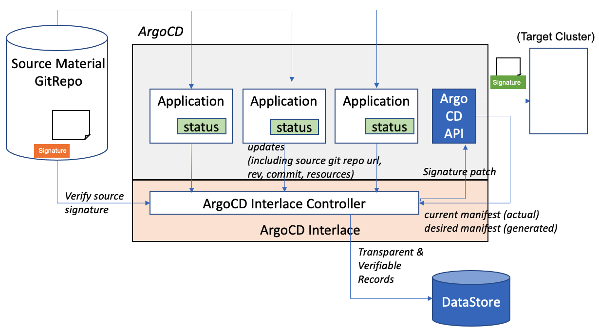

# ArgoCD Interlace

ArgoCD is widely used for enabling CD GitOps. ArgoCD internally builds manifest from source data in Git repository, and auto-sync it with target clusters. 

ArgoCD Interlace enhances ArgoCD capability from end-to-end software supply chain security viewpoint. Interlace adds authenticity of the manifest and the traceability to the source to ArgoCD.

ArgoCD Interlace works as a Kubernetes Custom Resource Definition (CRD) controller. Interlace monitors the trigger from state changes of Application resources on the ArgoCD cluster. When detecting new manifest build, Interlace sign the manifest, record the detail of manifest build such as the source files for the build, the command to produce the manifest for reproducibility. Interlace stores those details as provenance records in [in-toto](https://in-toto.io) format and upload it to [Sigstore](https://sigstore.dev/) log for verification.




The features are 
- Pluggable to ArgoCD
- Verify signature of source materials used for generating manifest
- Capture manifest and provenance from application.status automatically
- Sign manifest
- Record provenance in in-toto format

## Getting Started
### Installation
Prerequisite: Install [ArgoCD](https://argo-cd.readthedocs.io/en/stable/getting_started/) on your Kubernetes cluster before you install ArgoCD Interlace.


To install ArgoCD Interlace, run:
```
$ kubectl apply -f https://raw.githubusercontent.com/argoproj-labs/argocd-interlace/main/releases/release.yaml
```

On OpenShift, use this instead of the above.

```
$ kubectl apply -f https://raw.githubusercontent.com/argoproj-labs/argocd-interlace/main/releases/release_openshift.yaml
```

Then you can check whether ArgoCD Interlace is running just by looking at the pod status.

```
$ kubectl get pod -n argocd-interlace
NAME                                           READY   STATUS    RESTARTS   AGE
argocd-interlace-controller-5b6cd5f896-vwtrj   1/1     Running   0          2m
```

### Quick Start
By default, ArgoCD Interlace stores the generated provenance record in a custom resource `ApplicationProvenance` in `argocd-interlace` namespace.

When ArgoCD syncs any Applications, ArgoCD Interlace creates the ApplicationProvenance and you can see the provenance data as below.

```
$ kubectl get appprov -n argocd-interlace
NAME         AGE
sample-app   3m40s


$ kubectl get appprov -n argocd-interlace sample-app -o json
{
    "apiVersion": "interlace.argocd.dev/v1beta1",
    "kind": "ApplicationProvenance",
    "metadata": {
        "creationTimestamp": "2022-06-15T00:33:07Z",
        "generation": 1,
        "name": "sample-app",
        "namespace": "argocd-interlace",
        "resourceVersion": "1553595",
        "uid": "bc081b63-0595-4917-9a0e-2869a7dd1eeb"
    },
    "spec": {
        "application": {
            "name": "sample-app",
            "namespace": "argocd"
        }
    },
    "status": {
        "lastUpdated": "2022-06-15T07:04:05Z",
        "results": [
            {
                "manifest": "ICBh  ...  ODAK",
                "provenance": "eyJf  ...  fQ==",
                "sourceVerified": false,
                "time": "2022-06-15T07:04:05Z"
            }
        ]
    }
}
```

In the `spec` field, you can find which `Application` was the target of this provenance data.

In the `status` field, you can find the generated manifest for the `Application` sync and the provenance data generated by ArgoCD Interlace. (These two values are encoded in base64.)

For more details about the provenance data, you can refer this [doc](docs/provenance.md)

### Additional Features

ArgoCD Interlace supports 2 other features than the one about provenance records.

**1. Verify source material contents before generating provenance**

Before ArgoCD Interlace generates provenance data, it can verify the source metrial contents.
For that, you can sign the source meterials (Git Repo / Helm) beforehand (see the [doc](docs/signing_source_material.md)).
This allows you to confirm that the source contents of the synced application is valid by verifying the signature.

You can enable this feature by configuring the secret `source-material-verify-key` in argocd-interlace namespace.
You can do it by the following command. `<PATH/TO/PUBLIC_KEY>` should be the actual filepath.

```
$ KEY_PATH=<PATH/TO/PUBLIC_KEY> kubectl patch secret source-material-verify-key -n argocd-interlace -p="{\"data\":{\"public_key_pem\":\""(cat $KEY_PATH | base64)"\"}}"
```

*Note that it takes about a minute that the key in the running pod is updated after this command.*

With this feature, `sourceVerified` field in the ApplicationProvenance status will be `true` if the verification successfully finishes.

**2. Sign the generated provenance data**

By default, ArgoCD Interlace just generates a provenance data and the data is not authorized.
You can enable signing feature for the generated provenance data so that the provenance data can be verified when it is used somewhere other than ArgoCD / ArgoCD Interlace.

By configuring the secret `interlace-signing-key` in argocd-interlace namespace, you can enable this.
You can do it by the following command. `<PATH/TO/PRIVATE_KEY>` should be the actual filepath.

```
$ KEY_PATH=<PATH/TO/PRIVATE_KEY> kubectl patch secret interlace-signing-key -n argocd-interlace -p="{\"data\":{\"private_key_pem\":\""(cat $KEY_PATH | base64)"\"}}"
```

*Note that it takes about a minute that the key in the running pod is updated after this command.*

With this feature, `signature` field is added to the status in ApplciationProvenance and it contains the generated signature.

**3. Sign the manifest generated by ArgoCD**

Additionally, you can enable signing feature for the YAML manifest geneated by ArgoCD.
For this, ArgoCD Interlace leverages the manifest signing feature provided by sigstore community ([k8s-manifest-sigstore](https://github.com/sigstore/k8s-manifest-sigstore)).

To enable this, you can add a ConfigMap resource with a label `signatureResource: true` to your source material repository.
When this ConfigMap is found in the synced resources, ArgoCD Interlace signs the YAML manifest and the signature will be stored in the ConfigMap on the cluster.
This feature requires the 2 secrets configured by the above steps.

## Example Scenario
To see ArgoCD Interlace in action, check the [example scenario](docs/example_scenario.md).

### Demo
